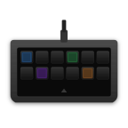

# OpenDeck Mountain DisplayPad Plugin

<p align="center">
  
</p>

An [OpenDeck](https://github.com/nekename/OpenDeck) plugin for the [Mountain DisplayPad](https://mountain.gg/keypads/displaypad/) — a 6×2 LCD button pad.

Written in Rust. Supports Windows and Linux. A macOS build is also produced, but it is **experimental and completely untested** — use at your own risk.

> [!WARNING]
> **This project was 100% vibecoded.** The author has no prior experience with Rust or OpenDeck's plugin system. The entire codebase — including the HID protocol implementation, the OpenDeck integration, and everything in between — was written through AI-assisted prompting. It works, but proceed with the appropriate level of caution.

## Features

- Displays icons on the 12 LCD buttons (102×102 pixels each)
- Button press detection and forwarding to OpenDeck
- Automatic image decoding, resizing, and BGR conversion
- HID protocol state machine matching the hardware specification

## Project Structure

```
├── driver/         # HID device driver (portable, no OpenDeck dependency)
├── adapter/        # OpenDeck integration layer
├── assets/         # Plugin icons
├── scripts/        # Build and packaging scripts
├── manifest.json   # OpenDeck plugin manifest
└── .devcontainer/  # Development container (Rust + cross-compilation)
```

## Building

### Using the devcontainer (recommended)

Open the project in VS Code and select **Reopen in Container**. Then:

```sh
cargo build --workspace
cargo test --workspace
```

### Cross-platform build (Docker)

Builds Linux and Windows binaries and packages them as a `.sdPlugin` zip:

```sh
docker build -t opendeck-devcontainer .devcontainer/
docker run --rm -v "${PWD}:/workspace" -w /workspace opendeck-devcontainer bash scripts/build-all.sh
```

The plugin zip is output to `dist/`.

> [!NOTE]
> The local Docker build produces Linux and Windows binaries only. The macOS binary cannot be cross-compiled from Linux (it requires the proprietary macOS SDK) and is built solely by the GitHub Actions release workflow on a macOS runner.

## Running Tests

```sh
# All tests
cargo test --workspace

# Driver tests only
cargo test -p driver

# Lint
cargo clippy --all -- -D warnings

# Format
cargo fmt --all -- --check
```

## Installation

1. Build the plugin zip (see above)
2. Copy `dist/com.vibecodedbymrwyss.plugins.displaypad.sdPlugin.zip` to OpenDeck's plugin directory
3. Restart OpenDeck

### Linux: udev rules

To allow non-root access to the DisplayPad on Linux:

```sh
sudo cp 40-opendeck-displaypad.rules /etc/udev/rules.d/
sudo udevadm control --reload-rules
```

Then unplug and replug the device.

## License

See [LICENSE](LICENSE).
